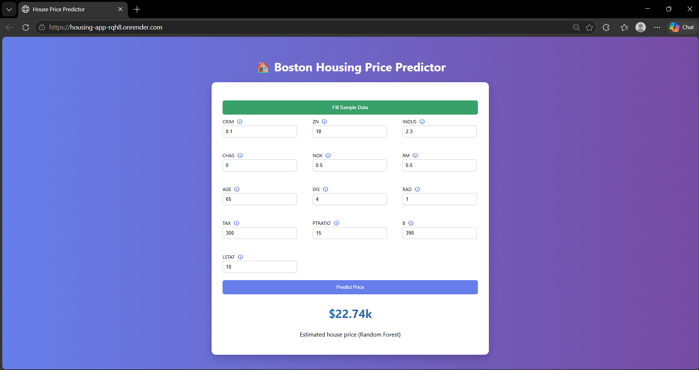

# 🏠 House Price Prediction — End-to-End Machine Learning Project

## 🚀 Live Demo

👉 https://housing-app-rqh8.onrender.com/

---

## 📌 Overview

This project demonstrates a complete **end-to-end machine learning pipeline** for predicting house prices using the Boston Housing dataset.

It covers the full workflow from **data analysis → model training → deployment**, and is delivered as a **production-ready web application**.

---

## 🧠 Models

The following regression models were implemented and evaluated:

* Linear Regression
* Support Vector Machine (SVM)
* Random Forest Regressor (**Best Performer**)

📊 **Best model performance:**

* R² Score: ~0.89
* Selected model: Random Forest

---

## ⚙️ Tech Stack

### 🔹 Backend

* Python
* Flask
* Scikit-learn

### 🔹 Frontend

* HTML, CSS, JavaScript

### 🔹 DevOps & Deployment

* Docker (containerization)
* GitHub Actions (CI/CD pipeline)
* Render (cloud deployment)

---

## ✨ Features

* Input all **13 housing features**
* Real-time prediction via web interface
* Feature scaling with `StandardScaler`
* Clean and responsive UI
* Deployed as a public web service

---

## 🏗️ Project Structure

```
project/
│
├── app/
│   ├── app.py
│   ├── templates/
│   └── static/
│
├── models/
├── data/
├── notebooks/
├── .github/workflows/
├── Dockerfile
├── requirements.txt
└── README.md
```

---

## 🐳 Run with Docker

```bash
docker build -t housing-app .
docker run -p 5000:5000 housing-app
```

👉 Open: http://localhost:5000

---

## 💻 Run Locally (Without Docker)

### Using Conda

```bash
conda create -n ml-app python=3.11
conda activate ml-app
pip install -r requirements.txt
python app/app.py
```

---

## 🔄 CI/CD Pipeline

This project uses **GitHub Actions** to automatically:

* Build Docker image
* Validate dependencies
* Run container tests

---

## 🌐 Deployment

The application is deployed on **Render** using Docker.

👉 Public URL:
https://housing-app-rqh8.onrender.com/

---


## 🏠 Screenshot UI

---

## 📊 Future Improvements

* Add feature importance visualization
* Improve UI/UX (loading states, better feedback)
* Compare multiple models directly on UI
* Add API documentation

---

## 📄 License

This project is for educational and portfolio purposes.
